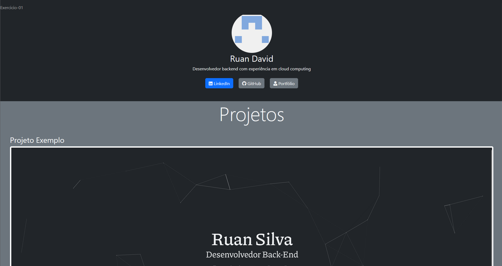
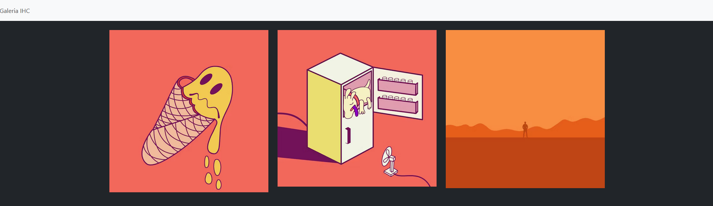
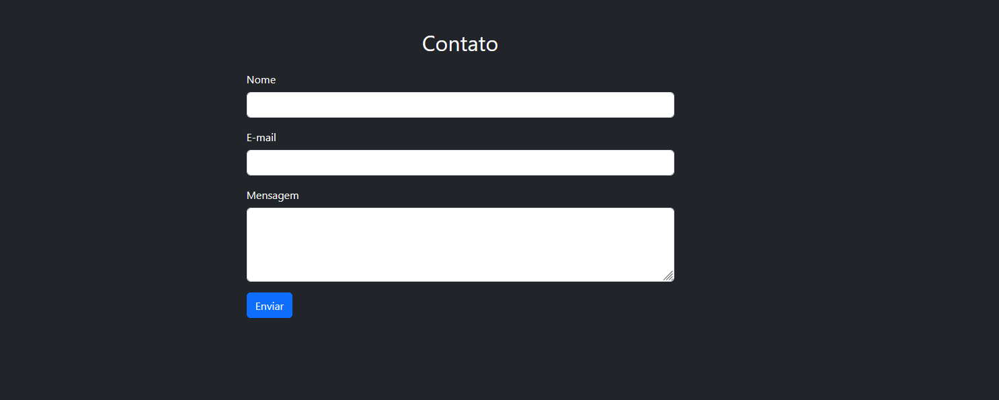

# Atividades Bootstrap

## ToC

- [Atividade 1](./atividade-0/index.html)

- [Atividade 2](./atividade-1/index.html)

- [Atividade 3](./atividade-2/index.html)

## Prints de tela

## Considerações Finais

Nos exemplos de código com Bootstrap podemos perceber a rapidez e menor quantidade de código ao utilizarmos um framework para o css. 
